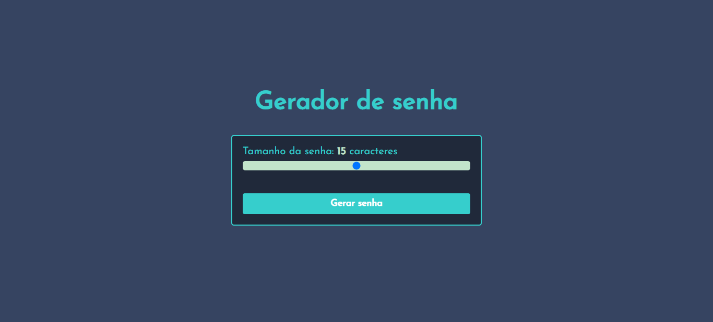

# gerador de senha

Link da página: <https://ronaldof16.github.io/gerador-de-senha/>

## Objetivo

Neste projeto o objetivo é fazer com que o usuário consiga gerar inúmeras senhas e 
de diversos tamanhos, para isso ele vai poder selecionar a quantidade de caracteres 
da senha através do input que permite alterar o tamanho da senha de maneira interativa 
com o mouse e clicando dentro do input, sem precisar digitar o tamanho desejado. Ao clicar 
no botão gerar senha, a senha será gerada e irá aparecer logo abaixo do botão, o usuário 
também vai ter a opção de copiar a senha clicando em cima dela, com isso não irá precisar 
selecionar e copiar a senha.

## Habilidades utilizadas

* HTML
* CSS
* JAVASCRIPT

